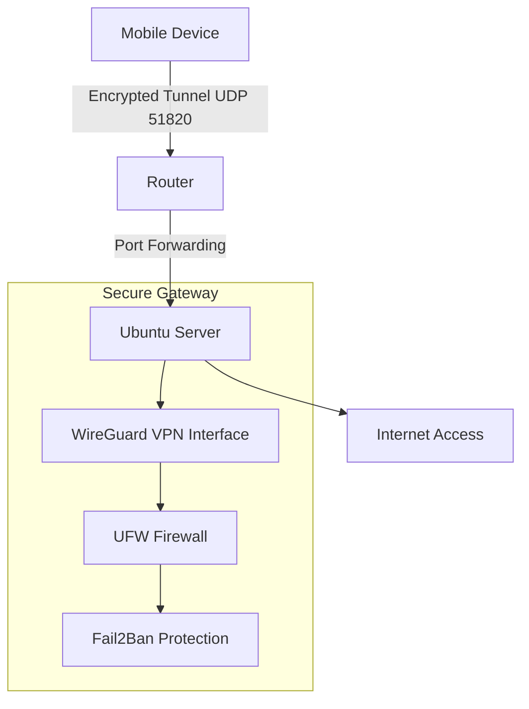

# Secure Mobile VPN Gateway Lab

## Overview

This project demonstrates the deployment of a secure mobile VPN gateway using WireGuard on Ubuntu Server.

The objective of the lab is to simulate a secure remote access infrastructure with firewall hardening and protection against brute-force attacks.

The VPN gateway allows mobile devices to securely access the network through an encrypted tunnel while minimizing the exposed attack surface.

---

## Architecture



---

## Technologies Used

- Ubuntu Server
- WireGuard VPN
- UFW Firewall
- Fail2Ban
- NAT / IP Forwarding
- VirtualBox

---

## Security Features

• Encrypted VPN tunnel using WireGuard  
• Firewall configured with **default deny policy**  
• SSH brute-force protection using Fail2Ban  
• Reduced host visibility by restricting ICMP echo responses  
• Minimal exposed attack surface  

---

## Project Structure

architecture/ → Network diagrams and architecture documentation  

setup/ → Server installation and WireGuard configuration  

security/ → Firewall rules and Fail2Ban configuration  

screenshots/ → Evidence of the lab running  

roadmap/ → Future improvements and expansion plans  

---

## How to Run

Clone the repository:

```bash
git clone https://github.com/YOUR_USERNAME/secure-mobile-vpn-gateway.git
```

Install required packages:

```bash
sudo apt update
sudo apt install wireguard ufw fail2ban
```

Enable IP forwarding:

```bash
sudo nano /etc/sysctl.conf
```

Add:

```
net.ipv4.ip_forward=1
```

Configure NAT rules in:

```
/etc/ufw/before.rules
```

Start the WireGuard interface:

```bash
sudo wg-quick up wg0
```

Verify the VPN status:

```bash
sudo wg show
```

---

## Screenshots

This section will include evidence of the lab environment running:

- WireGuard tunnel status
- UFW firewall rules
- Fail2Ban protection
- Mobile VPN connection

---

## Project Status

Phase 1 – Local Lab Deployment

The current version of the project demonstrates a functional VPN gateway running in a virtualized environment with security hardening applied.

---

## Future Improvements

Planned next steps include expanding the infrastructure to simulate a production environment:

- Cloud deployment of the VPN gateway
- IDS integration using Suricata
- Honeypot deployment for attack observation
- Centralized log monitoring with Wazuh
- Network segmentation using pfSense firewall

---

## Author

Cybersecurity student building hands-on security labs to develop practical skills in:

- Network security
- Infrastructure hardening
- Threat detection
- Secure remote access architectures
